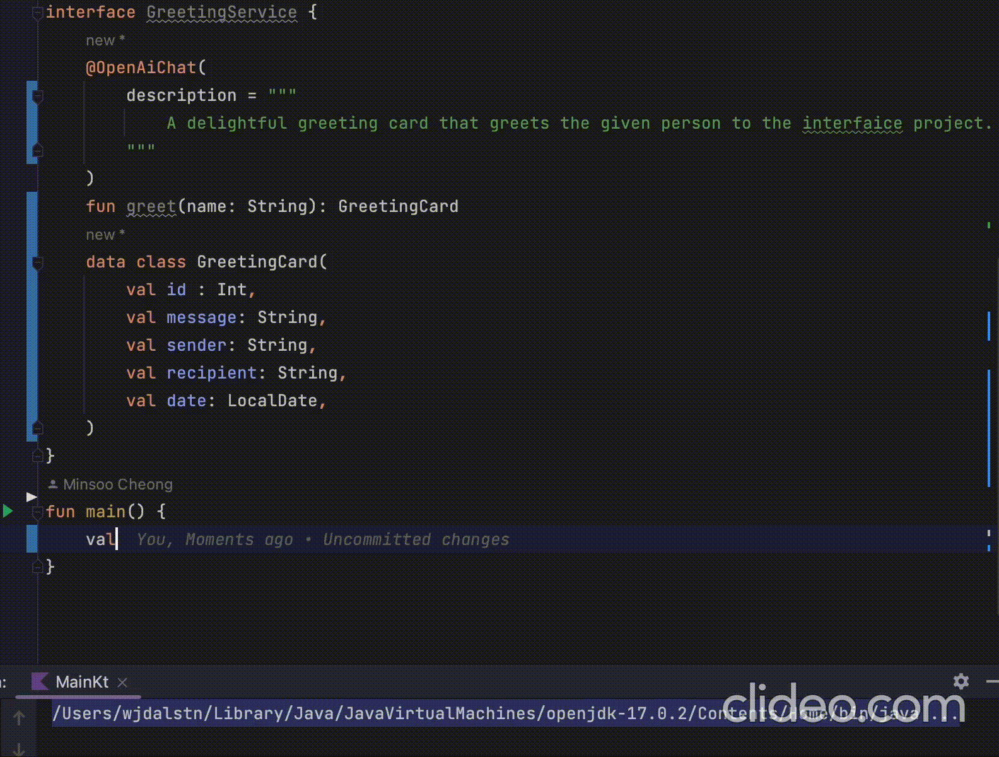

# interfAIce

### AI itself as your implementation

<p float="left">
  
  
</p>

check out my [blog post](https://medium.com/@mscheong01/harness-the-power-of-gpt-just-by-defining-an-interface-8ccfa0b94a8c) that introduces interfAIce
## Features

- Automatic AI powered proxy generation for your interfaces
- Spring Boot integration
- Java Reactor & Kotlin Coroutines support

## Installation & Usage

In your project's `build.gradle.kts` file, add the following:
- kotlin
    ```kotlin
    dependencies {
        implementation("io.github.mscheong01:interfAIce-core:1.0.0")
    }
    
    // This option is currently required for reflection to work
    // Later releases will remove this requirement for Kotlin projects
    tasks.withType<KotlinCompile> {
        this.kotlinOptions {
            freeCompilerArgs = listOf("-Xjsr305=strict")
            javaParameters = true
        }
    }
    ```
- java
    ```kotlin
    dependencies {
        implementation("io.github.mscheong01:interfAIce-core:1.0.0")
    }
    
    // This option is currently required for reflection to work
    // If all your classes have a no-arg constructor, you can remove this option
    tasks.withType<JavaCompile> {
        options.compilerArgs.add("-parameters")
    }
    ```
- spring boot
  1. add the spring boot starter dependency along with the appropriate java compile -parameter option configuration above
    ```kotlin
    dependencies {
        implementation("io.github.mscheong01:interfAIce-spring-boot-starter:1.0.0")
    }
    ```
  2. add the `@EnableInterfaiceProxies` annotation to your spring boot application class or any of its configuration classes
    ```kotlin
    @EnableInterfaiceProxies(
        basePackages = ["io.github.mscheong01.interfaice.examples"]
    )
    @SpringBootApplication
    open class ExampleApplication
    ```
  3. specify your OpenAi api key in the `application.yml` file
  ```yaml
  spring:
  interfaice:
    openai:
      api-key: ${OPENAI_API_KEY}
      chat:
        default-model: gpt-3.5-turbo # optional, defaults to gpt-3.5-turbo
  ```
  4. add the `@OpenAiInterface` annotation to your interface
    ```kotlin
    @OpenAiInterface
    interface ExampleInterface {
        fun greet(name: String): String
    }
    ```
  That is it! You can now use your interface as if it was implemented by a real class.
  ```kotlin
    @RestController
    class ExampleController(
        private val exampleInterface: ExampleInterface
    ) {
        @GetMapping("/greet")
        fun greet(@RequestParam name: String): String {
            return exampleInterface.greet(name)
        }
    }
    ```

## Snapshot Versions
interfAIce provides snapshot versions that are automatically released when changes are pushed to the main branch.
The current snapshot version is the next minor version of the current release version with a -SNAPSHOT suffix.
For example, if the current release is 1.2.3, the snapshot version will be 1.3.0-SNAPSHOT.

To use snapshot versions, add the maven snapshot repository to your build configuration
```kotlin
repositories {
    maven {
        url = uri("https://s01.oss.sonatype.org/content/repositories/snapshots/")
    }
}
```

## Contributing

Contributions are welcome! Please see our [contributing guidelines](https://github.com/mscheong01/interfAIce/blob/main/CONTRIBUTING.md) for more information.

## License

This project is licensed under the [Apache 2.0 License](https://github.com/mscheong01/interfAIce/blob/main/LICENSE).
