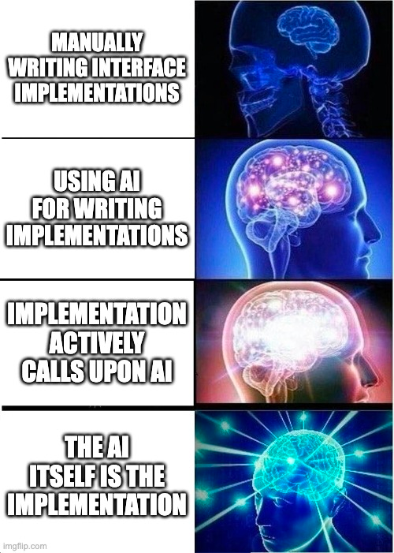

# interfAIce

----------------

### AI itself as your implementation

<p float="left">
  
  
</p>

## Features

- Automatic AI powered proxy generation for your interfaces
- Spring Boot integration
- Java Reactor & Kotlin Coroutines support

## Installation & Usage

In your project's `build.gradle.kts` file, add the following:
- kotlin
```kotlin
dependencies {
    implementation("io.github.mscheong01:interfAIce:1.0.0")
}

// this option is currently required for reflection to work
// later releases will remove this requirement for Kotlin projects
tasks.withType<KotlinCompile> {
    this.kotlinOptions {
        freeCompilerArgs = listOf("-Xjsr305=strict")
        jvmTarget = JavaVersion.VERSION_17.toString()
        javaParameters = true
    }
}
```

## Snapshot Versions
interfAIce provides snapshot versions that are automatically released when changes are pushed to the main branch.
The current snapshot version is the next minor version of the current release version with a -SNAPSHOT suffix.
For example, if the current release is 1.2.3, the snapshot version will be 1.3.0-SNAPSHOT.

To use snapshot versions, add the maven snapshot repository to your build configuration
```kotlin
repositories {
    maven {
        url = uri("https://s01.oss.sonatype.org/content/repositories/snapshots/")
    }
}
```

## Contributing

Contributions are welcome! Please see our [contributing guidelines](https://github.com/mscheong01/interfAIce/blob/main/CONTRIBUTING.md) for more information.

## License

This project is licensed under the [Apache 2.0 License](https://github.com/mscheong01/interfAIce/blob/main/LICENSE).
